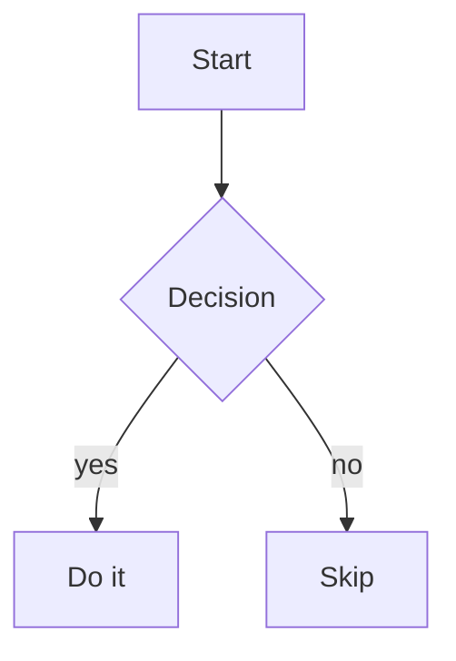
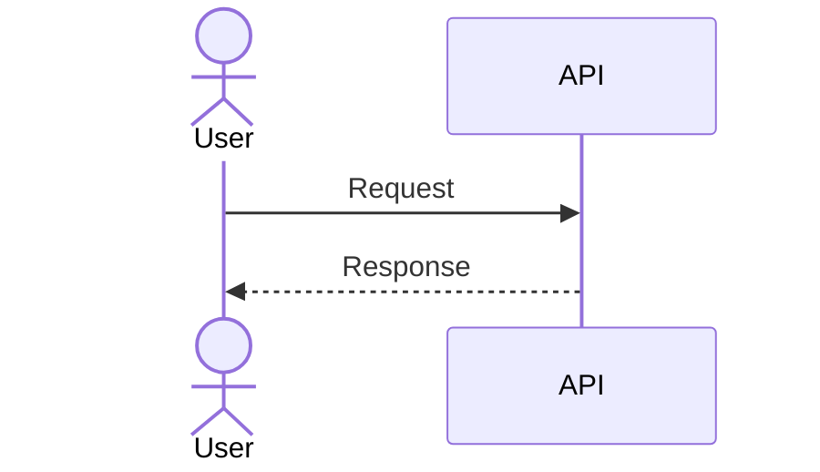
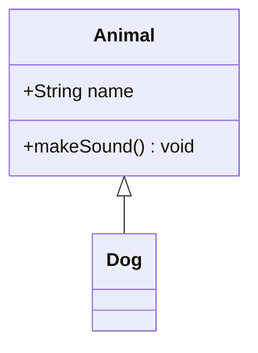
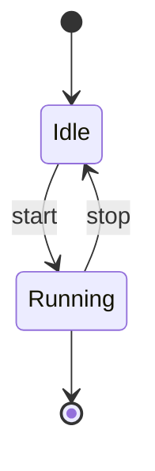
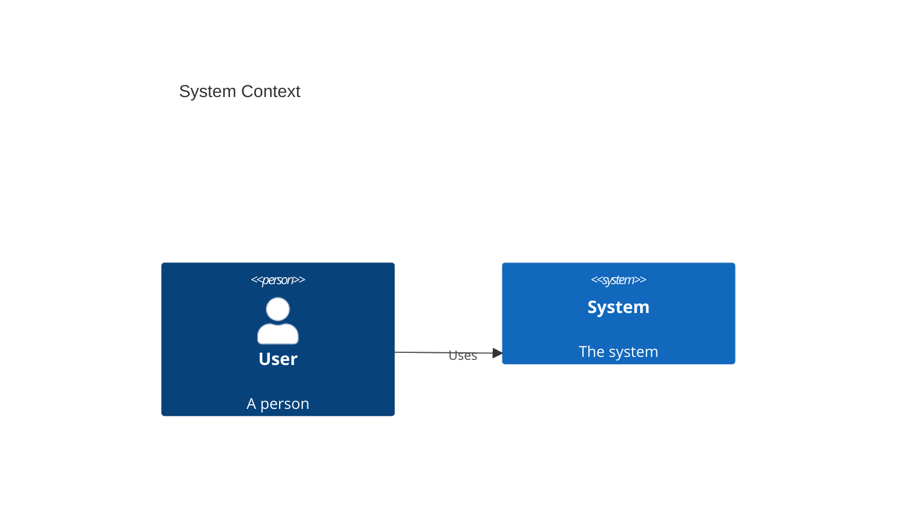
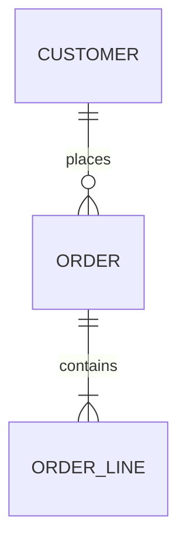
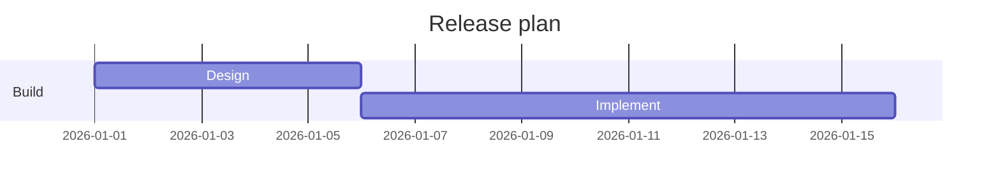
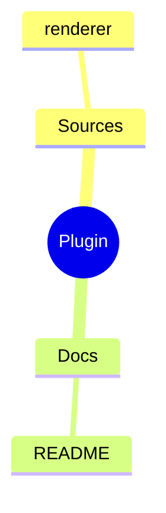
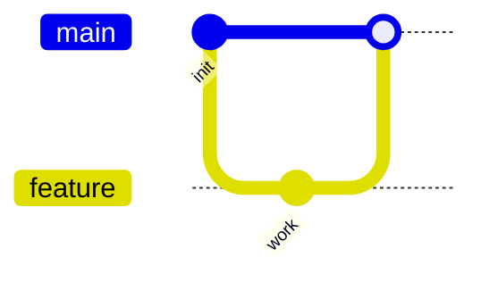

# Diagram types: verified minimal syntax

Every snippet below was rendered to SVG by `scripts/render-diagrams.mjs` with its pinned toolchain
(`@mermaid-js/mermaid-cli@12.0.0`, bundling `mermaid@12.0.0`) before being written down. Copy a
snippet, replace the labels, and render. Each type also lists the pitfall that breaks it most often.

## Version honesty notes

- **`usecase-beta` requires Mermaid 12.** It landed in Mermaid 12.0.0 and has no 11.x backport. On
  `@mermaid-js/mermaid-cli@11.17.0` (mermaid 11.17.2) it fails with
  `UnknownDiagramError: No diagram type detected matching given configuration for text: usecase-beta`.
  The renderer pins `@mermaid-js/mermaid-cli@12.0.0`, the lowest CLI that renders all ten types.
- **C4 is flagged experimental upstream** (`C4 Diagram 🦺⚠️` in the Mermaid docs). It renders, but its
  layout is fragile with many nodes and its syntax may change between releases.
- **No type failed on the pinned version.** All ten render on `@12.0.0`; the only failure observed was
  `usecase-beta` on the 11.x line, whose workaround is to keep the `@12.0.0` pin.
- **Mermaid 12 changed the default look.** Flowcharts and sequence diagrams render differently than
  under Mermaid 11. Add `mermaid.config.json` beside the sources with `{"look": "classic"}` to keep the
  earlier appearance; Wayfinder does exactly that.

## flowchart



Pitfall: `end` is a reserved word and cannot start a node id, and unquoted labels break on `(`, `)`,
`[`, `]`, `{`, `}`, and `"`. Wrap such text in quotes.

## sequenceDiagram



Pitfall: every `alt`/`opt`/`loop` needs a matching `end`; a stray or missing `end` fails the whole
diagram. A colon in a message label is fine, but the label itself must stay on one line.

## classDiagram (UML)



Pitfall: the arrow direction carries the meaning. `Animal <|-- Dog` reads "Dog inherits Animal";
reversing it silently inverts the model. A class named after a keyword (`class`, `namespace`) fails.

## stateDiagram-v2



Pitfall: use `stateDiagram-v2`, not the legacy `stateDiagram`. A transition label is everything after
the first `:` on the line, so an unescaped second `:` is taken literally rather than as a separator.

## C4 (experimental)



Pitfall: the keyword is case-sensitive (`C4Context`, `C4Container`, `C4Component`, `C4Dynamic`,
`C4Deployment`). Upstream marks C4 experimental; keep diagrams small, because the layout overlaps
nodes as the graph grows.

## erDiagram



Pitfall: entity names are case-sensitive and a relationship must have exactly one cardinality token
on each side of the line (`||`, `o{`, `|{`, `}o`, …). A missing or doubled symbol fails to parse.

## usecase-beta (Mermaid 12+)

```mermaid
usecase-beta
direction LR
actor Customer
systemBoundary Storefront
  Browse("Browse catalogue")
  Checkout("Checkout")
end
Customer --> Browse
Customer --> Checkout
Checkout ..> : include Browse
```

Pitfall: one statement per physical line — a second statement on the same line is a parse error.
Actors are never inferred from a relationship, so declare every actor with `actor ID`. Use
`..> : include` / `..> : extend` for UML include/extend semantics; an association label containing the
words include or extend is still a plain association.

## gantt



Pitfall: `dateFormat` must appear before the first task. A task line missing both a date and a
duration silently drops out of the chart instead of erroring.

## mindmap



Pitfall: hierarchy comes from indentation, so mixing tabs and spaces breaks the tree. Node shapes use
exact delimiters (`((circle))`, `(rounded)`, `[square]`); a mismatched pair fails to parse.

## gitGraph



Pitfall: order is stateful — `merge` needs the branch to exist and the current checkout to be its
target. This type illustrates a branching strategy; do not paste real repository history into it.
