# Alisio plugins

[Español](./README.es.md) · English

The official monorepo of independently publishable `@alisio/plugin-*` packages that extend the
[Alisio](https://github.com/GustavoGutierrez/alisio) coding agent. Each package installs on its own
and is versioned on its own; nothing here is a framework you must adopt.

## Quick path

**Install a plugin into Alisio**

```bash
alisio install npm:@alisio/plugin-wayfinder   # global, per-user
alisio plugins list                           # confirm it is installed
```

For local development, build the package and load it from a path instead:

```bash
pnpm --dir packages/wayfinder build
alisio --plugin ./packages/wayfinder/dist/index.js
```

**Start developing a plugin**

```bash
corepack enable
pnpm install
pnpm check          # lint, types, tests, build, pack check
```

Then read [site/developing-plugins.md](./site/developing-plugins.md) — it is the full authoring
reference for this repository. The canonical upstream contract lives in the
[Alisio plugin docs](https://gustavogutierrez.github.io/alisio/plugins).

## Repository layout

| Path | What it holds |
| --- | --- |
| `packages/` | One publishable `@alisio/plugin-*` package per directory. |
| `diagrams/` | Mermaid `.mmd` sources, one directory per diagram target. |
| `site/` | VitePress catalog site and repository guides (`site/developing-plugins.md`); run `pnpm docs:dev`. |
| `registry/` | Third-party registrations for the plugin catalog (`registry/plugins.json`). |
| `scripts/` | Repository tooling: diagram renderer, catalog scan, pack check, publish helpers. |
| `.agents/skills/` | Project skills that guide contributors and agents. |
| `assets/` | Generated SVGs for repository-level documents (not a package). |

## How plugins work



`plugin-architecture.svg` is the static view: which sources may load a plugin, what the host
validates before any plugin code runs, where the `api` boundary between host and plugin sits, and how
a model tool call reaches the effect gate that decides whether it runs.



`plugin-runtime-lifecycle.svg` follows one plugin from a trusted source through contract validation
and activation to its capability registrations, rollback on failure, and final teardown.


`plugin-development-flow.svg` follows a change from scaffolding a package to publishing it and
smoke-testing the installed result.

## What a plugin can and cannot do

| A plugin can… | A plugin cannot… |
| --- | --- |
| Register tools, commands, event observers, context providers and resources. | Run in a sandbox. It runs in-process with the user's full privileges. |
| Store small state and open a private SQLite database. | Isolate itself from the host with `effect`; that field is availability metadata only. |
| Hook compaction and session start/end, and call `model.complete`. | Preempt blocking synchronous code with a hook timeout. |
| Spawn capability-narrowed child sessions. | Grant a child a capability its parent lacks. |
| Provide model providers and extension points (`mascot`, `startup-screen`, `websearch`). | Import another plugin or `@alisio/core`. |
| Contribute skills and prompt templates. | Make its agent definitions appear in the built-in subagents catalog in the same boot. |

The full capability surface, the hard limits and the sharpest failure modes live in
[site/developing-plugins.md](./site/developing-plugins.md).

## Packages

| Package | Category | Purpose |
| --- | --- | --- |
| [`@alisio/plugin-wayfinder`](packages/wayfinder#readme) | `methodology-harness` | Coordinates a durable specification-driven development workflow with bounded child sessions. |
| [`@alisio/plugin-thesis`](packages/plugin-thesis#readme) | `methodology-harness` | Plans, researches, drafts and typesets university theses with verified evidence and deterministic quality gates. |

`methodology-harness` is a strict, host-validated catalog category. It requires an Alisio runtime
that carries `@alisio/core` `0.1.0-alpha.15` or newer; a plugin cannot declare that dependency itself,
so each package documents its own minimum runtime (see the Wayfinder README).

## Package conventions

- Name every publishable package `@alisio/plugin-*` and include the `alisio-plugin` keyword.
- Keep each plugin independently installable and self-contained; never import another plugin or
  `@alisio/core`.
- Ship ESM JavaScript and declarations from `dist`, target Node `>=22.16`, and keep `@alisio/sdk`
  as both a peer and a dev dependency.
- Every package needs a description, a README, its own MIT `LICENSE`, and unit tests.

## Required checks

| Command | What it verifies |
| --- | --- |
| `pnpm check` | Lint, leak check, types, tests, build, and the pack check (names, metadata, exports, files, licenses, READMEs, built JS/types, packaged resources, and a leak scan of each packed tarball). |
| `pnpm diagrams:check` | That every committed SVG is newer than its `.mmd` source. A local authoring aid, not a CI gate. |

Run `pnpm check` before opening a review. Use Changesets for versions; never hand-publish.

## Releasing

Releases are explicit and dry-run first; nothing is published without an authorized operator and
working npm authentication (`npm login`, or `NPM_TOKEN` with publish rights on the `@alisio` scope).

```bash
pnpm bump-one -- @alisio/plugin-<name> patch --summary "Public change summary"
pnpm publish-one -- @alisio/plugin-<name>             # dry run
pnpm publish-one -- @alisio/plugin-<name> --publish   # real publish
pnpm publish-all                                      # dry run for every package
pnpm publish-all --publish                            # real publish for every package
```

The tooling refuses to publish from a dirty tree, a version already on the registry, or a package
whose `package.json` and `src/version.ts` disagree. It also packs each package and scans the tarball
for local machine paths and credentials (`pnpm pack:check`, which runs the leak scanner over each
tarball), so published packages carry neither.
Dist-tags default to `latest`, and to `next` for prerelease versions. `pnpm release:changesets` is the
Changesets-native, tag-creating flow used by CI; `pnpm publish-all` is the explicit, preflighted flow.

## Contributing and support

- [CONTRIBUTING.md](./CONTRIBUTING.md) — how to add a plugin, the checks, and PR expectations.
- [SECURITY.md](./SECURITY.md) — the trusted-code model and how to report a vulnerability.
- [CODE_OF_CONDUCT.md](./CODE_OF_CONDUCT.md) — the Contributor Covenant and enforcement contact.
- [site/developing-plugins.md](./site/developing-plugins.md) — the plugin authoring guide.
- [Upstream Alisio plugin docs](https://gustavogutierrez.github.io/alisio/plugins) — the canonical SDK
  and `PluginAPI` reference.

---

This README and its Spanish mirror are kept in sync and must be updated together.
