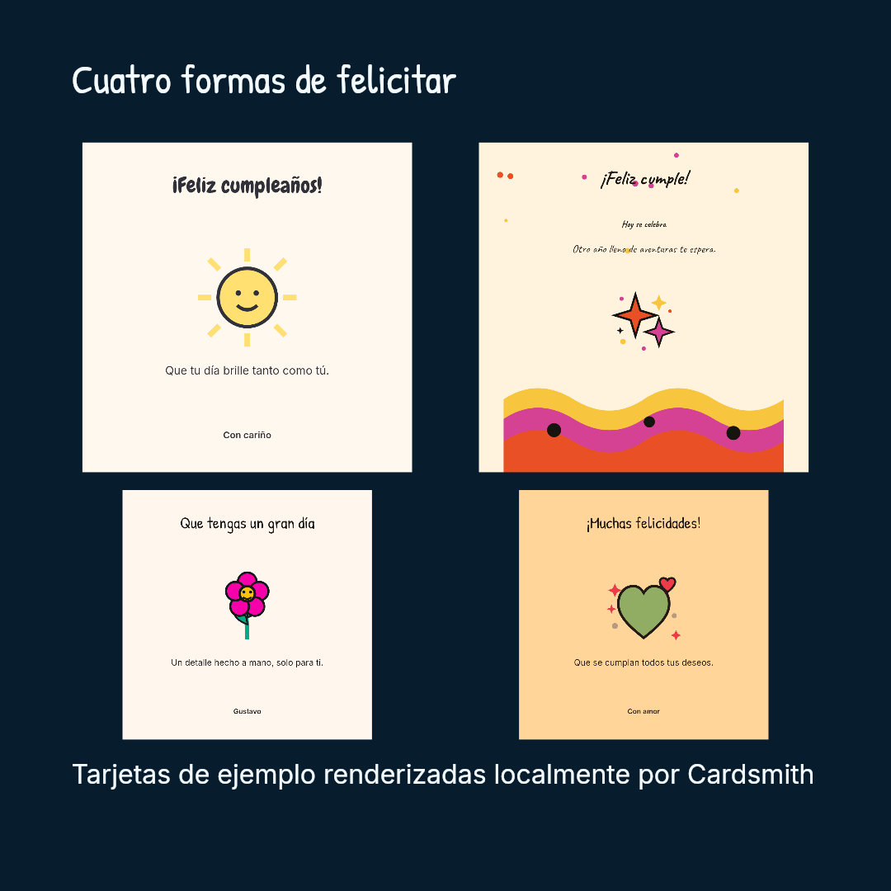

# @alisio/plugin-cardsmith


> Español: [README.es.md](./README.es.md). The two READMEs must be updated together.

Cardsmith interprets a chat request into validated, locally rendered card images: social cards,
certificates, badges, banners, photo composites, charts and dynamic data cards. The model writes
text only; templates, palettes and fonts are local resources and the plugin draws the pixels.

## Examples

Every card is a validated local render — the model only wrote the text.




The four cards and the collage come from `samples/generate-readme-cards.mjs`; the renderer is
deterministic, so rerunning the script reproduces byte-identical PNGs.

## Install

```bash
alisio install npm:@alisio/plugin-cardsmith
```

## Tools

| Tool | Effect | What it does |
| --- | --- | --- |
| `card_catalog` | read | Lists template ids with compatible sizes, required fields and feature flags, plus palette, font pair, size and format ids. |
| `card_design` | write | Validates a design spec and persists a draft with a revision. No pixels yet. |
| `card_update` | write | Patches a draft with the revision you last saw (`expectedRevision`); `content` merges per key. Deterministic, no model call. |
| `card_render` | write | Renders `preview` while iterating or the exportable `final`; publishes an artifact when the host bridge is available. |
| `card_export` | write | Copies the final image into the workspace; `move` deletes the working file only after a verified copy. |

## A chat walkthrough

**User.** Make a birthday card for my sister Ana.

1. **Design.** `card_design` with family `social`, templateId `illustrated-greeting` and
   `content: { title: "¡Feliz cumpleaños, Ana!", message: "Que tengas un día enorme.", author: "Con cariño" }`.
   Cardsmith answers `draft <id> revision 1: created social/illustrated-greeting at
   social-portrait 1080x1350, palette alegria-botanica, format png.`
2. **Recolor.** “Make it warmer” becomes `card_update` with `expectedRevision: 1` and
   `patch: { paletteId: "amor-calido" }`. Palette, size and font changes are deterministic and
   never require another model call or a hand-made render.
3. **Render.** `card_render` with `mode: "preview"` shows a small image in chat; when the user is
   happy, `mode: "final"` renders the exportable PNG (JPEG on request).
4. **Save.** `card_export` with `path: "assets/ana-birthday.png"` copies the final image into the
   workspace. Download saves to the user's browser; export writes to the Alisio server workspace.
   `move` is used only when asked.

## What ships

Sixteen templates across five families:

- **social** — `editorial-photo`, `illustrated-greeting`, `retro-message`, `metric-summary`
- **personalized** — `certificate-classic`, `badge-clean`, `banner-promo`
- **composite** — `photo-caption`, `watermark`, `image-collage`
- **chart** — `bar`, `line`, `scatter`, `donut`
- **dynamic** — `inventory-product`, `status-card`

Plus six palettes, 39 palette-recolorable illustrations — 28 original in-house pieces plus ten CC0
imports and one CC BY 4.0 Twemoji cherry blossom, credited in
[THIRD_PARTY_NOTICES.md](./THIRD_PARTY_NOTICES.md) — nine static TTF files in six font pairs and a
vendored QR code generator. Every resource is versioned inside the package, nothing is fetched at
render time, and system fonts are never used.

## How rendering works

Images are rendered on this machine with [`@napi-rs/canvas`](https://github.com/Brooooooklyn/canvas)
(Skia-backed). The package ships its own templates, palettes and static TTF fonts; it never
downloads resources while rendering and does not depend on fonts installed on the system.

`@napi-rs/canvas` is a deliberate, documented exception to the repository's "Node built-ins and
`@alisio/sdk` only" dependency policy: professional text shaping and rasterization are not
achievable with Node built-ins alone, and the package ships platform-specific prebuilt binaries.
[THIRD_PARTY_NOTICES.md](./THIRD_PARTY_NOTICES.md) records that exception and audits the full
dependency set, including the vendored QR code generator and every shipped font file with its
SHA-256.

## Determinism, cache and limits

- Same input, same bytes: a fixed environment (renderer, template, fonts, resources and image
  bytes) reproduces the same image for the same spec and seed. No timestamps reach the scene.
- One render is capped at 12 MP; input images at 20 MB each and 60 MB total, checked before and after decoding.
- Renders run two at a time through a bounded queue; the SHA-256 cache reuses identical renders.
- QR codes draw whole modules with a quiet zone and at least 4 px per module, or fail with
  `QR_TOO_DENSE`.
- Drafts, working files and the cache live under the plugin state directory (`.alisio/cardsmith`
  in the workspace when the host exposes no `api.paths`).

## Headless and TUI notes

Tool results are compact text: ids, revisions, dimensions, palette and font names, warnings and
actionable error codes. Rendered images travel as `image` parts (base64 in the tool result), and
no dialog or widget ever blocks headless execution; without the artifact bridge, `card_render`
still returns the image and reports the limitation precisely.

## External renderer

`@alisio/plugin-cardsmith/renderer` renders one design spec without Alisio, plugin setup or the
SDK, so an application can serve cards from its own authenticated endpoint:

```ts
import { renderCard } from "@alisio/plugin-cardsmith/renderer";

const card = await renderCard({
  family: "dynamic",
  templateId: "inventory-product",
  content: { productName: "Runner 2", price: "89.90", currency: "EUR", sku: "RS-2" },
});
// card.bytes: PNG/JPEG bytes — card.width, card.height, card.mimeType, card.warnings
```

For a `GET /api/products/:id/card.png`-style endpoint, `createCardRequestHandler` adapts the
renderer over `node:http`: GET and HEAD only, `ETag` from the image hash and a **private** cache
policy (never public, because the data is), while your `CardEndpoint` owns authentication, data
and error codes:

```ts
import { createServer } from "node:http";
import { createCardRequestHandler, renderCard, type CardEndpoint } from "@alisio/plugin-cardsmith/renderer";

const endpoint: CardEndpoint = {
  async handle({ url }) {
    const product = await findProduct(url.pathname); // host app: auth + data
    if (product === undefined) return { status: "not-found" };
    return { status: "ok", rendered: await renderCard({
      family: "dynamic", templateId: "inventory-product",
      content: { productName: product.name, price: product.price },
    }) };
  },
};
createServer(createCardRequestHandler(endpoint)).listen(3000);
```

## Development

```bash
pnpm --filter @alisio/plugin-cardsmith build
pnpm --filter @alisio/plugin-cardsmith typecheck
pnpm --filter @alisio/plugin-cardsmith test
node packages/plugin-cardsmith/samples/generate-readme-cards.mjs  # regenerate the Examples images
pnpm check  # lint, leak, typecheck, test, build and pack:check for the whole repository
```

## Status

`0.1.0`: all five families render final images and the five tools design, update, render and
export them. Artifact publishing depends on the host bridge for external plugins; without it the
image still renders, exports to the workspace and reports the limitation.

## License

MIT. Third-party components and their licenses are listed in
[THIRD_PARTY_NOTICES.md](./THIRD_PARTY_NOTICES.md).
