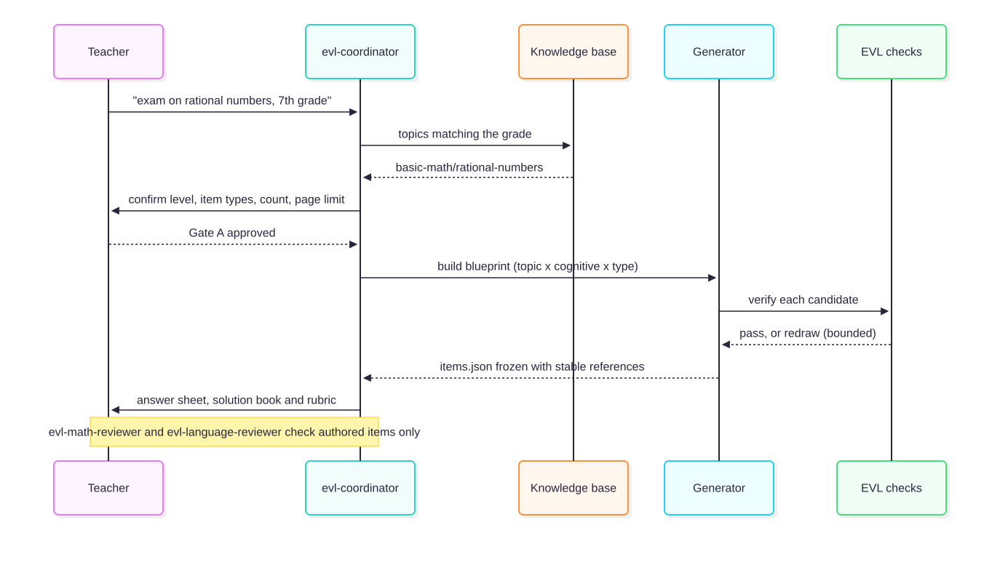

# @alisio/plugin-evalua

> Léelo en [inglés](./README.md). Ambos README se mantienen sincronizados y deben actualizarse juntos.

Evalúa ayuda a un docente a preparar exámenes de matemáticas imprimibles mediante una entrevista
breve y guiada, con las respuestas y los distractores calculados por código y un presupuesto de
páginas que se mide, nunca se adivina.

> Estado: v1 completo en funcionalidad. El perfil, el espacio de trabajo y la entrevista, el núcleo
> matemático exacto, la base de conocimiento extensible, la generación y verificación de ítems, y el
> flujo de extremo a extremo (Puerta A → generate → build → Puerta B) que escribe los cuatro
> documentos en HTML y PDF están implementados y probados.

## Instalación

```sh
alisio install npm:@alisio/plugin-evalua
```

Requiere Node 22.16 o superior y `@alisio/sdk` `>=0.3.0 <0.7.0`.

Para actualizar los plugins instalados: `alisio install --update` (todos) o
`alisio install npm:@alisio/plugin-evalua --update` (solo este). Para desarrollo local,
`npm install --save-dev @alisio/plugin-evalua` y luego `alisio --plugin @alisio/plugin-evalua`.

## Cómo se usa

Habla con el coordinador; empieza por el idioma, luego la institución, el docente y el logo
opcional, y crea el espacio de trabajo sobre la marcha. Después pide el examen en tres rondas
cortas. Nada se escribe en disco antes de la Puerta A, la aprobación del docente.



La entrevista pregunta solo lo que aún no sabe:

| Ronda | Preguntas |
| --- | --- |
| Perfil (una vez por espacio) | idioma, institución, nombre del docente, logo opcional |
| 1 — qué | tema (sugerencias de la base de conocimiento), grado, nivel (básico/intermedio/avanzado/genio), base de conocimiento |
| 2 — forma | tipos de ítems (selección múltiple), número de preguntas, mismo examen o banco, columnas |
| 2b — solo banco | tamaño del banco, número de variantes |
| 3 — impresión y tono | límite de páginas (las mínimas legibles, 1, 2 o la cantidad que escribas), tiempo e instrumento, texto de cierre |

También puedes usarlo sin interfaz: la ronda pendiente se guarda en el estado del espacio de trabajo
y continúas con `/evalua:new id=valor ...` (el texto libre va en `<id>:text=...`).

### Cómo se genera y se revisa un examen

La tabla de especificaciones es una rejilla de tema × demanda cognitiva × tipo de ítem. Los
candidatos salen primero de las familias de ítems y luego de los ítems estáticos del banco, y cada
candidato se verifica por código antes de congelarse; un candidato que falla se vuelve a sortear
(con límite) y una casilla que no se puede llenar se reporta.



## Agentes

`evl-coordinator` conduce la entrevista y las puertas en prosa y llama a las herramientas. Nunca
redacta una respuesta matemática: las familias, los solvers y el catálogo son la fuente de verdad.
Los ítems redactados los revisan de forma independiente `evl-math-reviewer` (solo lectura) y
`evl-language-reviewer` (solo lectura); el revisor nunca ve el razonamiento del autor.



## Comandos y herramientas

| Comando | Qué hace |
| --- | --- |
| `/evalua:init [dir] [--edit]` | Crea el espacio de trabajo (carpeta `evalua/` por defecto) y pide el perfil del docente una vez. |
| `/evalua:new [tema]` | Corre la entrevista del examen y guarda el borrador hasta la Puerta A. |
| `/evalua:status` | Muestra el perfil, la ronda pendiente, el borrador y las carpetas de examen. |
| `/evalua:approve a\|b` | La Puerta A asigna la carpeta del examen y congela `exam.yaml`; la Puerta B aprueba el paquete final. |
| `/evalua:generate` | Construye la tabla de especificaciones, genera y verifica los ítems y congela `items.json`. |
| `/evalua:build` | Lee la carpeta aprobada, ajusta el presupuesto de páginas y escribe el examen, la hoja de respuestas, el solucionario y la rúbrica en HTML y PDF. |
| `/evalua:kb` | Lista la base de conocimiento: packs, temas y niveles. |
| `/evalua:doctor` | Reporta la salud de la base de conocimiento y el navegador de impresión disponible. |

Herramientas para agentes: `evalua_profile`, `evalua_answer`, `evalua_status`, `evalua_kb`,
`evalua_check`, `evalua_exam`, `evalua_generate` y `evalua_build`.

CLI independiente:

```sh
alisio-evalua check    # el informe EVL-KB-*
alisio-evalua kb       # packs, temas y niveles en JSON
alisio-evalua doctor   # salud de la base de conocimiento y navegador
```

## Cómo funciona

- **Matemática exacta.** Las respuestas y los distractores salen de aritmética racional exacta
  (fracciones con BigInt) y un tipo pequeño de polinomio racional multivariable; el azar es un
  xoshiro128** con semilla, así que el mismo examen siempre reconstruye las mismas preguntas en el
  mismo orden.
- **Base de conocimiento extensible.** Packs YAML versionados declaran temas, calibración por nivel
  y fuentes (familias de ítems o ítems estáticos de banco). Un pack de workspace en
  `<root>/knowledge-packs/` extiende o reemplaza uno empaquetado sin tocar código. El cargador
  aplica `EVL-KB-001..007`.
- **Generación y verificación.** Una tabla de especificaciones determinista guía los candidatos por
  familias y luego banco, con un bucle de resorteo acotado, deduplicación y referencias estables;
  las comprobaciones `EVL-ITM-*` y `EVL-EXM-*` controlan el resultado.
- **Renderizado y ajuste.** Un modelo de documento tipado alimenta un emisor HTML autocontenido
  (KaTeX en el servidor, incrustado, sin red) y `printToPDF` de la familia Chrome; una escalera de
  densidad mide páginas reales y elige el preset más legible que cumpla el presupuesto, fallando de
  forma explícita con `EVL-LAY-001` cuando no puede. Una auditoría in-page revisa desbordamiento
  horizontal, cajas solapadas, texto bajo el piso, ajuste de fórmulas y espacio de respuesta
  (`EVL-LAY-002`, `EVL-LAY-004`).
- **Temas.** Se envían tres temas por datos (`classic`, `blue`, `dark`), elegidos por
  `exam.yaml.template` y extensibles desde `templates/themes/<id>/`.
- **Textos de cierre.** Un catálogo con fuente (frases célebres y versículos de la Reina-Valera 1909
  en dominio público) más una capa de citas de workspace para textos del docente; nada se escribe de
  memoria.

## Navegadores de impresión

Los PDF necesitan un navegador compatible con Chromium; no se descarga nada. La detección acepta
Google Chrome, Chromium, Brave, Microsoft Edge, Vivaldi y Opera en Linux, macOS y Windows, respetando
`ALISIO_EVALUA_CHROME`, `PUPPETEER_EXECUTABLE_PATH` y `CHROME_PATH`. Sin navegador, la construcción
igual escribe los HTML autocontenidos con KaTeX y avisa de que no se verificaron los límites de
página.

## Estructura del espacio de trabajo

```
<workspace>/
  .alisio/evalua/state.json     estado de la máquina (escrituras atómicas)
  evalua/
    teacher.yaml                perfil del docente, editable a mano
    assets/logo.png             logo opcional (PNG, JPEG o WebP, hasta 2 MB; SVG se rechaza)
    knowledge-packs/            packs de workspace opcionales (extienden o reemplazan los empaquetados)
    quotes/                     textos de cierre del docente, opcionales
    exams/NN-slug/              se crea solo después de que el docente aprueba la especificación
```

Los números de examen son consecutivos y nunca se reutilizan, aunque se borre una carpeta a mano.

## Campos del perfil

`teacherName`, `institution` (se imprime en mayúsculas), `logo` opcional, `subject` (por defecto
Matemáticas), `language` (por defecto `es`) y `paper` (`letter` o `a4`, por defecto `letter`).

## Licencia

MIT. KaTeX vendorizado es MIT; ver `THIRD_PARTY_NOTICES.md`.
