# @alisio/plugin-swarm

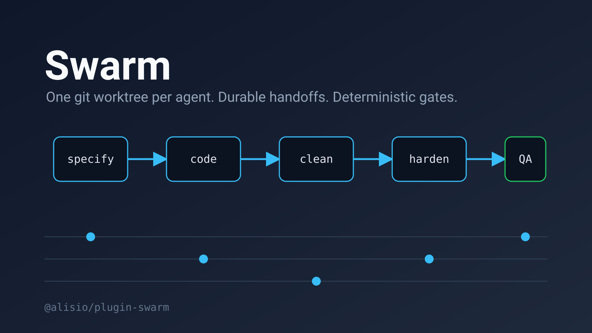

> English: [README.md](./README.md). Ambos README deben actualizarse en conjunto.

Swarm para Alisio ejecuta una cadena de agentes especializados. Cada agente trabaja en su propio
worktree de git y entrega el trabajo confirmado al siguiente mediante archivos de traspaso duraderos.
El código determinista controla el enrutamiento, el estado y las compuertas de calidad; los agentes
solo devuelven sobres JSON estrictos que el código valida.

> **Estado: versión preliminar.** Todo lo descrito está implementado y probado con simulaciones,
> incluido el panel local. El ejecutor de sesiones hijas de Alisio, la ejecución en segundo plano y el
> panel aún no se han probado contra un host real de Alisio; consulta «Uso real».

## Arquitectura


Los comandos, las herramientas, el panel y el árbol TUI son frentes delgados sobre una única capa de
servicios, que maneja el dominio puro mediante puertos (ejecutor de agentes, aislamiento, almacenes y
ejecutor de compuertas).

## Requisitos

- Node.js 22.16 o superior y `@alisio/sdk` de 0.3 a 0.6.
- `git` 2.28 o superior en el `PATH`. Ejecuta `/swarm:doctor` para comprobarlo.
- No requiere credenciales ni acceso a la red, salvo al clonar un repositorio de GitHub.

## Instalación

```sh
alisio install npm:@alisio/plugin-swarm
```

## Inicio rápido

```text
/swarm:init
/swarm:doctor
/swarm:pack list
/swarm:project new demo --pack two-pack -- Una aplicación pequeña de tareas
/swarm:task demo new -- Añadir un formulario para crear tareas
/swarm:status
/swarm:dashboard
```

## Comandos

| Comando | Propósito |
| --- | --- |
| `/swarm:init` | Crea la fragua bajo `.alisio/swarm` en el espacio de trabajo. |
| `/swarm:doctor` | Comprueba Node.js, git, los comandos de la cadena de herramientas y el espacio de trabajo. |
| `/swarm:pack list` / `show <nombre>` | Lista los paquetes incluidos y los del espacio de trabajo, o muestra uno. |
| `/swarm:project new <nombre> [--pack <p>] [--github <owner/repo>] -- <misión>` | Crea y abre un proyecto. |
| `/swarm:project open <nombre>` / `close <nombre>` / `list` | Abre, cierra o lista proyectos. Cerrar nunca modifica los archivos del proyecto. |
| `/swarm:task <proyecto> new [nombre] -- <texto>` | Crea una tarjeta de tarea y la encola para el primer rol. |
| `/swarm:task <proyecto> retry <nombre>` / `delete <nombre>` / `accept <nombre>` | Reintenta una tarea atascada, la archiva y elimina, o acepta su trabajo tal cual. |
| `/swarm:status [proyecto]` | Muestra carriles, tareas y elementos que requieren tu atención. |
| `/swarm:approve <proyecto>/<tarea>` | Aprueba el traspaso retenido en la compuerta de aprobación. Queda deshabilitado mientras existan comentarios sobre documentos. |
| `/swarm:reject <proyecto>/<tarea> retry\|delete\|accept [-- comentarios]` | Reintentar (el commit rechazado se conserva en `refs/swarm/rejected/<tarea>`, se restaura la base y el rol se ejecuta de nuevo con tus observaciones), eliminar o aceptar sin cambios. |
| `/swarm:comment <proyecto>/<tarea> <documento> -- <texto>` / `<proyecto>/<tarea> clear` | Comenta un documento de una tarea pendiente de aprobación, o borra los comentarios. |
| `/swarm:answer <proyecto>/<tarea> -- <texto>` | Responde a una pregunta de aclaración de un rol. |
| `/swarm:chat [proyecto] -- <mensaje>` | Conversa con el Lieutenant de un proyecto (solo lectura). |
| `/swarm:stop <proyecto>` | Cancela los agentes del proyecto y detiene su bomba; el proyecto sigue abierto. |
| `/swarm:run <proyecto> [--seconds <1-3600>]` | Ejecuta la bomba en primer plano hasta que el proyecto quede inactivo (consulta «Uso real»). |
| `/swarm:budget` / `budget raise <tokens>` | Muestra el presupuesto de tokens del enjambre o sube el límite. |
| `/swarm:dashboard [proyecto\|proyecto/tarea]` | Inicia el panel de seguimiento local e imprime su enlace (consulta «Panel»). |
| `/swarm:teardown --confirm TEARDOWN` | Cancela todos los agentes y detiene todos los proyectos. Los archivos se conservan. |

Una referencia es `<proyecto>/<tarea>` o el identificador de un elemento que requiere tu atención
(`approval:<proyecto>:<tarea>`). En una sesión interactiva, `approve`, `reject` y `teardown` preguntan
con `ui.askQuestions` cuando falta un argumento; sin interfaz, las formas de comando anteriores son el
contrato.

Las herramientas `swarm_status`, `swarm_task_new`, `swarm_gate_run` y `swarm_doctor` exponen los mismos
servicios a los agentes. `swarm_gate_run` ejecuta una compuerta de calidad para un rol y devuelve su
informe.

## Agentes

Todos los agentes llevan el prefijo `swarm-` (`swarm-specifier`, `swarm-coder`, `swarm-cleaner`,
`swarm-refactorer`, `swarm-architect`, `swarm-hardener`, `swarm-qa`, `swarm-lieutenant`) para que el
catálogo de agentes del host nunca choque con otro plugin que incluya un `specifier` o un `coder`. Los
identificadores de rol de los paquetes siguen siendo cortos (`coder`, `qa`); un único mapa del plugin
convierte el identificador de rol en el nombre del agente. Cada archivo de agente declara sus
herramientas, límite de turnos, tiempo máximo y presupuesto de salida; los hijos nunca pueden llamar a
`task`, `delegate`, `subagent` ni `sessions_create`, y los roles de solo lectura se ejecutan con
`readOnly: true`.

## Paquetes

Un paquete son datos: los roles en orden, qué rol trabaja en la copia principal, la compuerta de
aprobación, las compuertas de calidad y los umbrales. Los paquetes se distribuyen con el plugin y
también pueden vivir en `.alisio/swarm/packs/<nombre>.json` dentro del espacio de trabajo; un paquete
del espacio de trabajo reemplaza a uno incluido con el mismo nombre.


Las cadenas incluidas, en orden; la compuerta de aprobación va tras el especificador en four-pack y six-pack.

| Paquete | Cadena |
| --- | --- |
| `two-pack` | coder, cleaner |
| `four-pack` | specifier, coder, refactorer, architect (aprobación tras el specifier) |
| `six-pack` | specifier, coder, cleaner, architect, hardener, qa (aprobación tras el specifier) |

El traspaso del último rol se difunde, solo para fusionar, a todos los demás roles y mueve la tarjeta a
Hecho. Los umbrales por defecto (cobertura 80 %, complejidad 6, CRAP 8, mutación 80 %) son datos del
paquete y se pueden cambiar en cada uno. La fórmula de CRAP es la publicada:
`CC^2 * (1 - cobertura)^3 + CC`.

## Cómo funciona

- **Worktrees.** El rol maestro trabaja en la copia principal del proyecto. Cada uno de los demás roles
  recibe un worktree en la rama `swarm/<proyecto>/<rol>`. Un hook `commit-msg` añade `By <rol>.`.
- **Traspasos.** El trabajo viaja como un identificador de commit de diez caracteres dentro de un
  archivo con encabezado y cuerpo bajo `<proyecto>/.alisio/swarm/handoffs/<rol>/`. Los archivos son la
  fuente de verdad: tras una caída, la bomba reenvía la bandeja de salida y el tablero se reconstruye a
  partir de ellos.
- **Fusiones.** El coordinador fusiona el commit del emisor en el worktree del receptor antes de que
  este se ejecute. Los conflictos se entregan al rol receptor como parte de su tarea.
- **Protocolo de auditoría.** El primer sobre de traspaso queda en espera, se pide a la misma sesión que
  verifique de nuevo y un segundo sobre sin cambios lo libera.
- **Sobres estrictos.** La salida inválida (incluida la cortada por el límite de turnos) se rechaza,
  nunca se repara, y se reintenta como máximo una vez antes de que la tarjeta quede bloqueada y aparezca
  en lo que requiere tu atención.
- **Compuerta de aprobación.** En los paquetes con `approval.after`, el traspaso de ese rol queda
  retenido hasta que lo apruebes. Rechazar ofrece reintentar, eliminar o aceptar sin cambios.
- **Aclaraciones.** Un rol puede hacer una pregunta; la tarjeta pasa a `clarifying` y la pregunta se
  persiste, de modo que sobrevive a un reinicio. Tu respuesta reanuda la misma sesión (o una nueva con la
  pregunta repetida tras un reinicio).
- **Las retenciones sobreviven a los reinicios.** Se persisten las aclaraciones, los bloqueos que
  informa un agente, los fallos de compuertas, las aprobaciones y sus comentarios. Un fallo de ejecución
  (por ejemplo, salida rechazada dos veces) se reintenta tras un reinicio.

## Traspasos, auditorías y estados de tarea

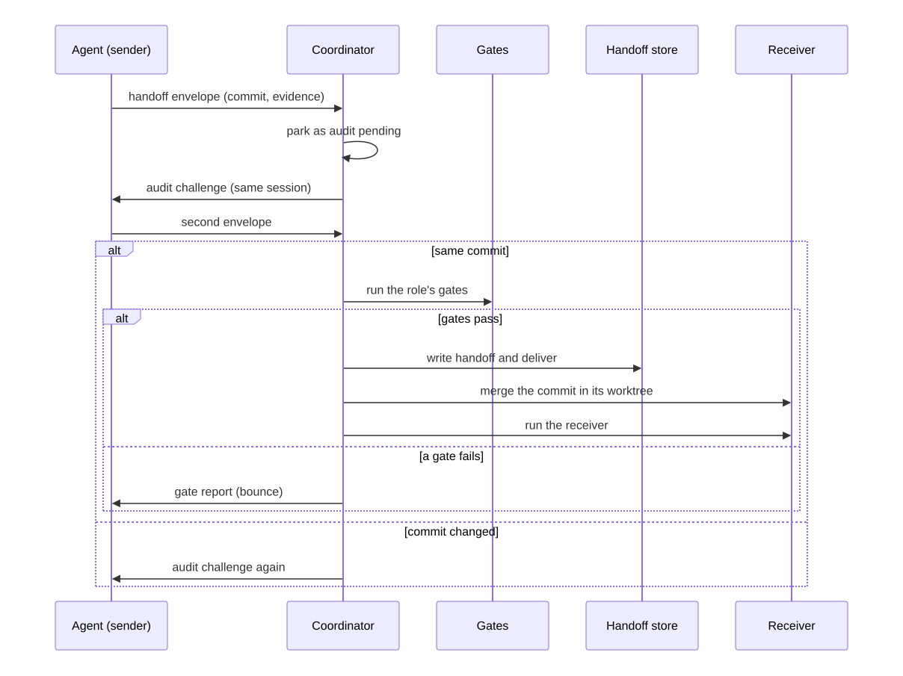

Un traspaso se retiene, se audita con un segundo sobre, pasa las compuertas del código y luego se entrega y fusiona.


Una tarjeta está `queued`, `working`, `merging`, `waiting_approval`, `clarifying`, `blocked`, `rejected` o `done`.


La auditoría libera un traspaso solo si el segundo sobre nombra el mismo commit y las compuertas pasan.


La aprobación se bloquea mientras existan comentarios; rechazar ofrece reintentar, eliminar o aceptar sin cambios.

## Compuertas de calidad

Cuando la auditoría no cambia, el coordinador ejecuta las compuertas del rol definidas en el paquete
(bloque `gates`) con el perfil de la cadena de herramientas `node-ts`. Una compuerta que falla devuelve
su informe al mismo rol, que lo corrige y vuelve a pasar la auditoría. Tras `limits.maxBounces` fallos
(2 por defecto) la tarea queda bloqueada y tú decides: reintentar (con margen renovado), aceptar tal cual
o eliminar.

| Compuerta | Qué comprueba |
| --- | --- |
| `tests-green` | El comando `test` del perfil termina con código 0. |
| `test-first` | Un archivo de pruebas forma parte del diff del rol desde su commit base. |
| `coverage` | La cobertura global de líneas del resumen cumple `thresholds.coverage`. |
| `crap` | En las funciones modificadas, la complejidad y CRAP (`CC^2 * (1 - cobertura)^3 + CC`, con la cobertura del archivo) se mantienen bajo `thresholds.complexity` y `thresholds.crap`. |
| `dry` | Ningún bloque de 6 líneas significativas idénticas se duplica frente a un archivo modificado. |
| `mutation` | Diferencial: Stryker se ejecuta solo sobre los archivos fuente modificados y la puntuación cumple `thresholds.mutation`. |
| `acceptance` | El comando `acceptance` del perfil (o `test` si no existe) termina con código 0. |
| `structure` | Se omite indicando el motivo: todavía no hay un verificador determinista de estructura. |

Los umbrales vienen del paquete, nunca de constantes. Los procesos de las compuertas se ejecutan con
vectores de argumentos, un tiempo máximo, un límite de salida y un entorno depurado. Una compuerta que
no puede ejecutarse en absoluto (herramienta ausente, informe ilegible) no devuelve el trabajo al rol:
bloquea la tarea indicando el motivo.

Rechazo de QA: cuando el último rol informa `blocked`, sus hallazgos vuelven al coder por defecto (o al
rol indicado por `rejectTo` en ese rol, o por una línea `route: <rol>` en los hallazgos), limitado por
`maxBounces`. Un paquete puede declarar etapas `parallel` (roles adyacentes que no sean el maestro ni el
último): se ejecutan a la vez y el siguiente rol recibe todos sus commits, fusionados en el orden del
paquete, cuando todos los roles de la etapa han entregado.

## Configuración de la cadena de herramientas

La versión 1 incluye un único perfil, `node-ts` (`assets/toolchains/node-ts.json`). Declara vectores de
argumentos y analizadores de salida, nunca cadenas de shell. Tu proyecto debe ofrecer:

| Entrada de la compuerta | Comando | Requiere |
| --- | --- | --- |
| pruebas | `npm test --silent` | un script `test` |
| cobertura | `npx vitest run --coverage --coverage.reporter=json-summary` | Vitest con proveedor de cobertura |
| complejidad (CRAP) | `npx eslint --format json --rule complexity ...` | ESLint |
| mutación | `npx stryker run --incremental` | Stryker con el reporte JSON |
| aceptación | `npm run --if-present test:acceptance --silent` | script opcional; si falta se usa `test` |

`/swarm:doctor` indica qué comandos faltan. Los umbrales y límites (`coverage`, `complexity`, `crap`,
`mutation`, `maxBounces`, `maxAuditRounds`) son datos del paquete. No se incluyen otras cadenas de
herramientas (go, java, python, clojure) en la versión 1.

## Presupuesto de tokens

`options.tokenBudget` es un límite flexible del total de tokens del enjambre. Al alcanzarlo, las bombas
dejan de iniciar ejecuciones nuevas (las que están en curso terminan) y aparece una decisión en lo que
requiere tu atención. Sube el límite con `/swarm:budget raise <tokens>`. Los roles inactivos nunca se
ejecutan: no hay agentes ansiosos.

## Uso real

Las sesiones hijas se crean bajo demanda a partir de la sesión que emitió el último comando `/swarm`,
con el worktree del rol como espacio de trabajo, y se cancelan al cerrar, detener, hacer teardown y
liberar el plugin. La bomba se ejecuta en segundo plano dentro del proceso del host. Aún no se ha
verificado contra un host real si una promesa que sobrevive a su comando sigue ejecutándose, cómo
programa el host las ejecuciones hijas concurrentes ni cómo se comporta `permission: ask` sin interfaz.
Si la bomba en segundo plano se detiene, `/swarm:run <proyecto>` la ejecuta en primer plano hasta una
hora; un pulso de seguridad de un segundo reinicia el trabajo detenido mientras el proceso siga vivo. Un
archivo pid bajo `.alisio/swarm` señala un proceso anterior que terminó sin limpiar.

## Opciones

Defínelas en `pluginOverrides.swarm.options` dentro de la configuración de Alisio:

| Opción | Valor por defecto | Significado |
| --- | --- | --- |
| `maxConcurrent` | `3` | Roles que se ejecutan a la vez (de 1 a 8). |
| `roles.<rol>.model` | modelo de la sesión | Modelo para un rol concreto. |
| `tokenBudget` | ninguno | Límite flexible del total de tokens (mínimo 1000). |

## Panel

El panel es una **vista de seguimiento** del enjambre que se ejecuta en tu espacio de trabajo. El
trabajo se inicia y se gestiona desde el chat de Alisio con comandos `/swarm:*`; la página solo ofrece
lo que el chat hace peor: ver muchos roles a la vez, leer evidencias y tomar decisiones de revisión
junto a ellas. Todos los roles, incluido el Lieutenant, se ejecutan como sesiones hijas de Alisio.

`/swarm:dashboard [proyecto | proyecto/tarea]` inicia una página web local en `127.0.0.1` (puerto
efímero), imprime su enlace e intenta abrir el navegador; el argumento opcional enlaza directamente a
un proyecto o tarjeta (`#proyecto/tarea`). Si no hay nada en ejecución, la página indica que empieces
desde el chat (`/swarm:project new`, `/swarm:task <proyecto> new`).

El tablero con la franja de atención, en el tema claro. Una aprobación, una aclaración y una
compuerta fallida esperan tu decisión; la tarjeta `shuffle` aparece resaltada mientras se fusiona.

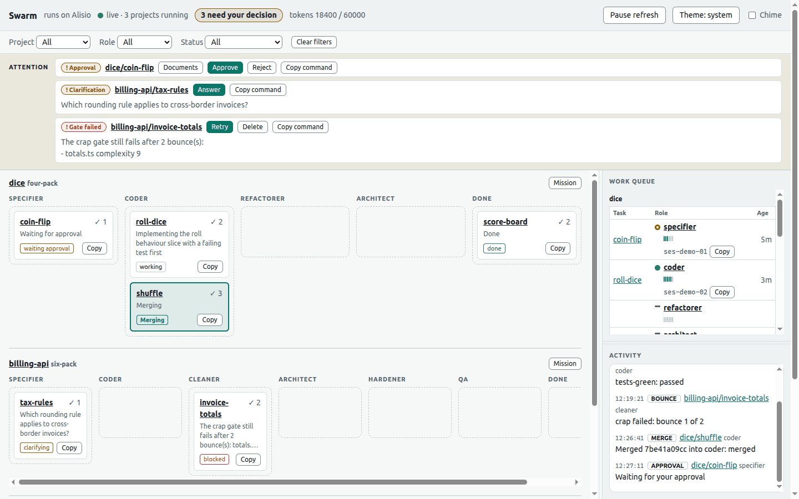

La misma vista en el tema oscuro, que sigue el ajuste del sistema salvo que lo cambies a mano.

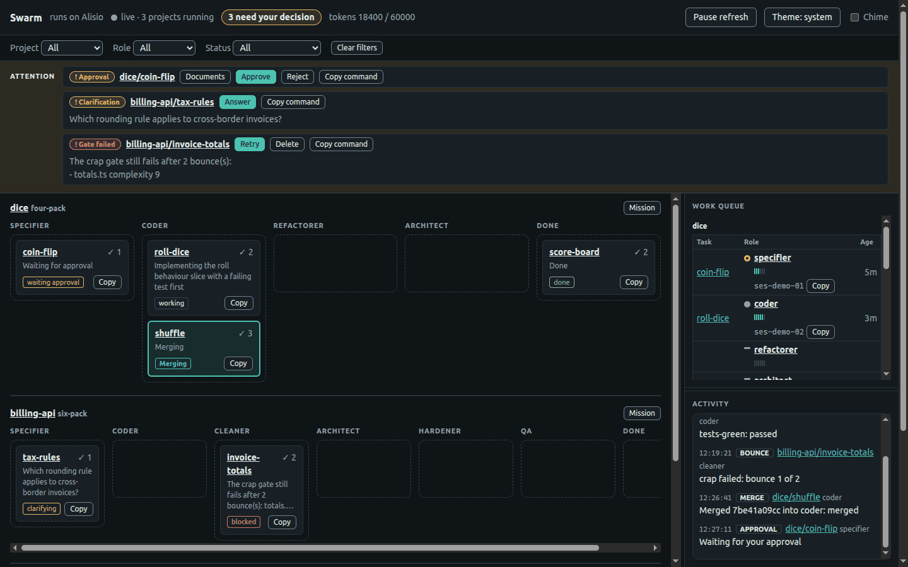

La cola de trabajo lista cada rol con un marcador live, idle o none (con etiqueta de texto además
del color), un medidor de actividad y su id de sesión de Alisio; el registro de actividad recoge
traspasos, fusiones, compuertas y rebotes.

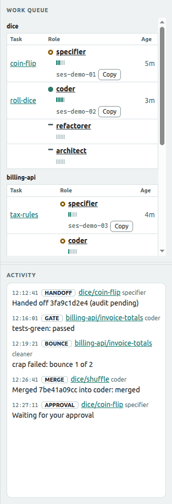

Selecciona un rol para leer el final de su sesión de Alisio: los últimos prompts y respuestas.

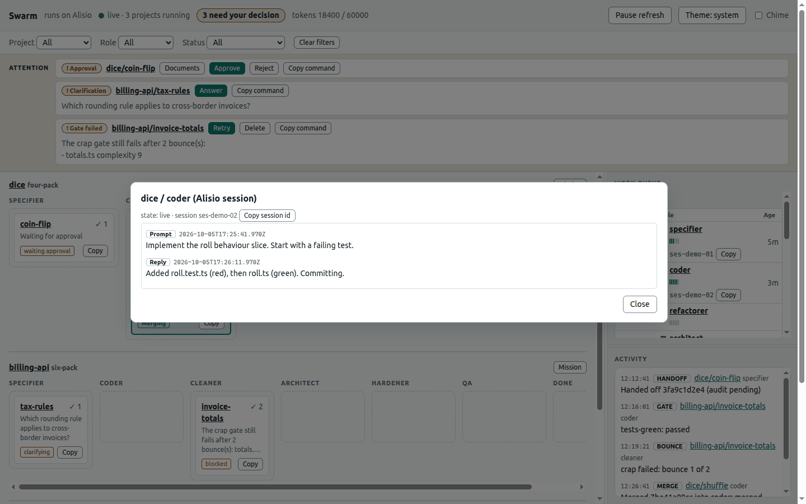

Documentos muestra los archivos retenidos para aprobación, un diff lado a lado desde la base del rol
hasta el commit retenido y tus comentarios. Approve queda deshabilitado mientras existan comentarios.

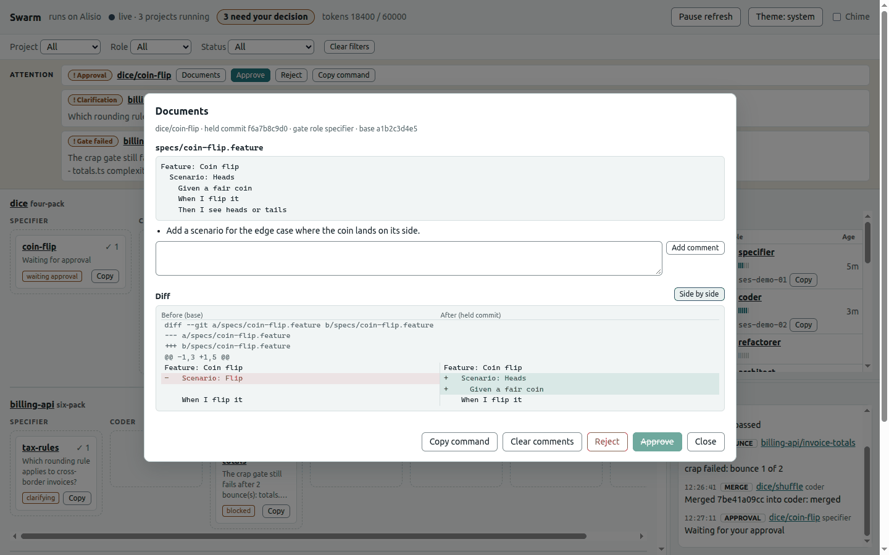

Reject permite reintentar con tus comentarios, eliminar la tarea o aceptar el trabajo sin cambios.

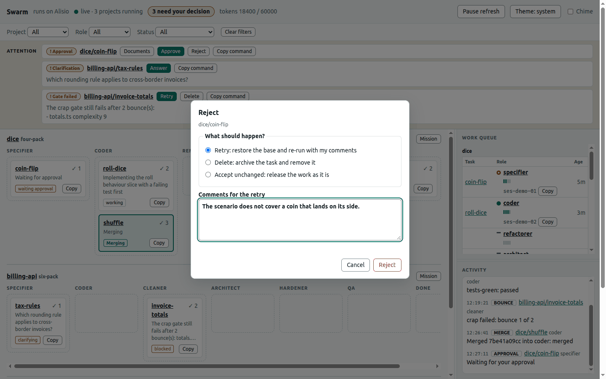

Cuando no hay nada en ejecución, la página indica que empieces desde el chat de Alisio.

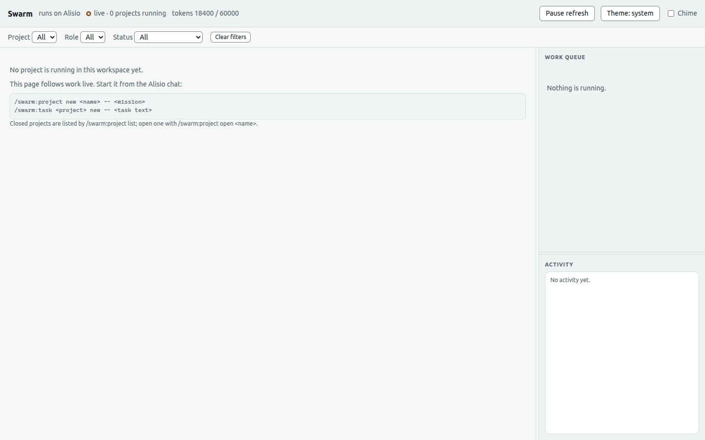

También funciona en pantallas de teléfono.

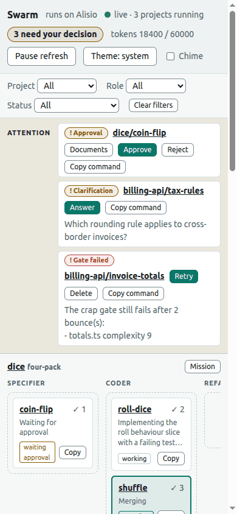

Todas las capturas usan datos de demostración sintéticos servidos por `demo/dashboard-demo.mjs`.

| Parte | Qué muestra o hace |
| --- | --- |
| Barra superior | Indicador de estado, contador de «requiere tu decisión» (también en el título de la pestaña y el icono), presupuesto de tokens, pausa de actualización, tema y aviso sonoro. |
| Filtros | Proyecto, rol y estado; pausa la actualización mientras lees un diff o una transcripción largos. |
| Franja de atención | Elementos de aprobación, aclaración, bloqueo y compuerta fallida con Documents, Approve, Reject, Answer, Retry y Delete, más un botón que copia el comando equivalente del chat. |
| Tablero | Una banda por proyecto en ejecución, una columna por rol del paquete más DONE; las tarjetas muestran auditorías, un resumen del estado, resaltado al fusionar y un botón para copiar el comando. |
| Cola de trabajo | Tarea, rol, antigüedad, marcador live/idle/none con etiqueta de texto, medidor de actividad de 0 a 6, el id de sesión de Alisio con botón de copia y los últimos prompts y respuestas de un rol. |
| Actividad | Traspasos, fusiones, resultados de compuertas, rebotes y esperas de aprobación recientes. |
| Documentos | Archivos de la tarea, un diff lado a lado o unificado desde la base del rol hasta el commit retenido y comentarios por documento (Approve queda deshabilitado mientras existan comentarios). |

Respeta el tema claro u oscuro del sistema (con opción manual), usa tokens de diseño alineados con la
aplicación web de Alisio, funciona en pantallas de teléfono y nunca depende solo del color. Los únicos
cambios que puede hacer son las decisiones anteriores, que llaman a los mismos servicios que los
comandos. No puede crear, abrir, cerrar ni desmontar proyectos o tareas, y no incluye chat: es una
decisión del propietario, de modo que la página nunca duplica un comando.


La página consulta `/api/state` cada dos segundos. Sin un host que pueda mostrarlo, los mismos datos
están en `/swarm:status` (tablas y una cadena en mermaid), un árbol `ui.panel` (proyectos, roles,
tareas) y la vista de datos de solo lectura `swarm-board`; cada uno se registra solo si el host lo
ofrece. Para inspeccionar la interfaz sin un host, desde una copia del repositorio compila el paquete y ejecuta
`node demo/dashboard-demo.mjs`: sirve la página con datos sintéticos.

## Seguridad

Los comandos de git y de las compuertas se ejecutan con vectores de argumentos y un entorno depurado,
nunca mediante un shell. Los identificadores y las rutas se validan, las rutas de un proyecto no pueden
salir de su raíz mediante enlaces simbólicos, y los archivos persistentes se escriben de forma atómica
con permisos privados y versión de esquema.

El panel escucha solo en loopback. Cada petición exige un token aleatorio de 256 bits (cookie para
leer, cabecera para modificar), un `Host` de loopback y, si existe, un `Origin` local; no hay CORS, la
política de seguridad de contenido es `default-src 'self'`, los cuerpos se limitan a 256 KiB, todo
identificador se valida y el texto de agentes y tareas se muestra siempre como texto. El enlace que
imprime el comando lleva el token: no lo compartas. Los documentos se leen del almacén de objetos de
git, así que ninguna ruta puede salir del repositorio. El plugin nunca hace push ni abre pull requests.

## Límites

- Sin verificar contra un host real: la bomba en segundo plano, las ejecuciones hijas concurrentes,
  `permission: ask` sin interfaz y un espacio de trabajo hijo que sea un worktree (consulta «Uso real»).
- El SDK no ofrece API de transcripciones: la actividad de un rol en el panel es lo que el plugin
  registró (prompts y respuestas acotados), no la transcripción del host.
- Los agentes hijos no pueden llamar a herramientas del plugin; solo responden con sobres JSON.
- La versión 1 solo incluye la cadena `node-ts`; la compuerta `structure` se omite con un motivo explícito.
- Sin tmux ni agentes CLI externos; sin push ni pull requests; Windows no es un objetivo más allá de no fallar.
- Los umbrales son valores por defecto nuestros, no de SwarmForge, que no publica ninguno.

## Atribución

Inspirado en SwarmForge, de Robert C. Martin (`unclebob/swarm-forge`). Es una implementación
independiente de las ideas; no se copia texto ni código del original y la licencia del proyecto
original no se ha confirmado.

## Licencia

MIT
