# @alisio/plugin-thesis


> English: [README.md](./README.md). Ambos README deben actualizarse en conjunto.

Thesis Studio para Alisio. Te entrevista, planifica la investigación, investiga cada sección hasta
formar una biblioteca de evidencia verificada, redacta solo a partir de evidencia aprobada, revisa el
resultado de forma independiente y compone una tesis universitaria en el idioma que elijas. El código
determinista decide cada compuerta que pueda; los agentes hijos solo proponen. La política proviene de
paquetes versionados y con fuentes, y las reglas de tu institución siempre prevalecen.

## Requisitos

- Node.js 22.16 o superior y `@alisio/sdk` 0.3 a 0.6. No se necesitan credenciales.
- Motor de PDF: ejecuta `/thesis:setup` una vez para instalar en la caché el Typst fijado (con SHA-256
  verificado). Sin Typst, `/thesis:build` recurre a Chrome o Chromium sin interfaz, y
  `/thesis:build --html` no necesita ninguno.
- La investigación consulta OpenAlex, Crossref y arXiv (orígenes fijos). Define
  `ALISIO_THESIS_CONTACT_EMAIL` para usar sus «polite pools»; se lee solo del entorno y nunca se
  almacena ni se registra.

## Instalación

```sh
alisio install npm:@alisio/plugin-thesis
```

## Inicio rápido

```text
/thesis:init                 # crea thesis/ e inicia la entrevista (primero el idioma)
/thesis:design               # redacta research/protocol.md; aprueba las compuertas humanas A y B
/thesis:outline              # redacta outline/outline.json; aprueba la compuerta OUTLINE
/thesis:research SEC-03      # busca, verifica, valora; lee evidence/dossiers/SEC-03.md
/thesis:draft SEC-03         # redacta, edita y revisa la sección; tú la apruebas
/thesis:build                # genera el PDF (o /thesis:build --html)
```

`/thesis:status` muestra la fase, las compuertas y el siguiente paso, y `/thesis:next` lo ejecuta. En
una sesión sin interfaz, `/thesis:init` devuelve las preguntas con sus opciones y la sintaxis exacta de
`/thesis:answer`: las respuestas son pares `id=valor` separados por espacios o saltos de línea, o un
único objeto JSON; el texto libre va en `<id>:text=...`.

## Arquitectura



Los comandos, las herramientas y la CLI llegan a un único coordinador en TypeScript. Este ejecuta
agentes hijos de solo lectura, acepta únicamente JSON validado, escribe él mismo todos los archivos,
ejecuta las comprobaciones y entrega un `ThesisDocument` neutral al puerto de renderizado. Un adaptador
DOCX futuro está previsto y no se incluye todavía.

## Ciclo de vida



La tesis avanza desde la entrevista y el diseño, pasando por tres compuertas humanas, a un ciclo por
sección y luego a la revisión, la finalización (compuerta humana C) y una compilación PDF/A.

### El ciclo por sección

1. `/thesis:research SEC-id`: busca, verifica y valora; tú validas el dossier.
2. `/thesis:draft SEC-id`: el redactor recibe solo evidencia citable y devuelve Markdown con anclas de
   afirmaciones. El código valida claves de cita, anclas, etiquetas y figuras, escribe
   `chapters/NN-slug.md` y `claims/claims.jsonl` y ejecuta las comprobaciones. Luego el editor cambia
   solo la redacción: el código compara citas, anclas, números, etiquetas y fórmulas antes y después y
   rechaza cualquier cambio. Tú apruebas, pides una revisión o vuelves a la investigación. La
   aprobación compila las secciones aprobadas.
3. Cuando todas las secciones están aprobadas, la tesis entra en revisión: `/thesis:review all`,
   corrige o descarta los hallazgos y luego `/thesis:finalize`.

Los resúmenes se redactan al final; la declaración de uso de IA, la dedicatoria y los agradecimientos no
requieren investigación; la bibliografía se genera desde la biblioteca.

## Comandos

| Comando | Propósito |
| --- | --- |
| `/thesis:init [dir] [--lang <bcp47>] [--presentation]` | Crea el espacio de trabajo y ejecuta la entrevista |
| `/thesis:answer -- <id=valor ...\|json>` | Responde las preguntas pendientes sin interfaz |
| `/thesis:status` | Fase, compuertas, secciones y siguiente paso |
| `/thesis:next` | Ejecuta el siguiente paso recomendado |
| `/thesis:check [gate...]` | Ejecuta las comprobaciones y escribe `build/check-report.json` |
| `/thesis:design`, `/thesis:outline` | Redactan el protocolo o el esquema y piden las compuertas humanas |
| `/thesis:approve <destino> [-- notas]` | Registra una aprobación: `A`, `B`, `OUTLINE`, `C`, `SEC-id`, `FND-id`, `ETH-id`, `norms`, `style:id` |
| `/thesis:revise <destino> -- <comentarios>` | Envía comentarios al rol responsable del destino |
| `/thesis:research <SEC-id\|next> [-- ...]` | Investiga una sección; `-- add <DOI o URL; título; año; tipo>` verifica una fuente que ya tienes |
| `/thesis:draft <SEC-id\|next> [-- comentarios]` | Redacta, edita, comprueba y pide aprobación |
| `/thesis:figure <SEC-id> -- <solicitud>` | Redacta un gráfico, diagrama o tabla (devuelve el Markdown a insertar) |
| `/thesis:review [SEC-id\|all]` | Revisión independiente; los hallazgos van a `reviews/FND-*.json` |
| `/thesis:finalize` | G9 y G10, compuerta humana C, compilación PDF/A, `build/submission/` |
| `/thesis:build [full\|approved\|SEC-id] [--pdfa] [--html]` | Genera el PDF o la vista previa HTML |
| `/thesis:setup` | Instala el motor Typst fijado (con suma de verificación) |
| `/thesis:pack new\|list\|check\|explain` | Crea, lista, comprueba y explica paquetes de políticas |
| `/thesis:style new\|list\|check` | Crea, lista y comprueba estilos de cita y perfiles |
| `/thesis:norms import -- <texto de guía\|URL\|ruta>` | Convierte una guía o rúbrica en un paquete del espacio de trabajo (tú lo apruebas) |
| `/thesis:doctor` | Informa motores, paquetes incluidos y paquetes de políticas; no cambia nada |

Los argumentos usan `<destino> -- <texto>`. Las URL de guías solo se obtienen mediante una herramienta
`web_fetch` del anfitrión.

## Herramientas

| Herramienta | Propósito |
| --- | --- |
| `thesis_scholar_search` | Busca en OpenAlex, Crossref o arXiv |
| `thesis_scholar_resolve` | Resuelve un DOI o identificador a un registro académico |
| `thesis_status` | Resume el espacio de trabajo |
| `thesis_check` | Ejecuta las comprobaciones deterministas |
| `thesis_build` | Genera la tesis |

## CLI

```sh
alisio-thesis check [dir] [--json] [--gate G0,G7] [--no-write]
alisio-thesis build [dir] [full|approved|SEC-id] [--pdfa] [--json]
alisio-thesis bib [dir] [--check]
alisio-thesis doctor [--json]
alisio-thesis style list|check [dir] [--json]
```

`check` termina con 0 si ninguna comprobación falla, 1 si alguna falla y 2 ante errores de uso o de
entorno, por lo que sirve en CI y en hooks de git.

## Estructura del espacio de trabajo

```text
thesis/
  thesis.yaml              # ficha del proyecto (editable por personas)
  compliance-profile.json  # reglas resueltas con su rastro de ruleId
  research/protocol.md     outline/outline.json
  evidence/                # library.jsonl, rejected.jsonl, search-log.jsonl, dossiers/
  claims/claims.jsonl      bibliography/references.bib   (generado, nunca se edita a mano)
  chapters/  chapters/annexes/
  figures/{charts,diagrams,images}/   data/
  styles/                  # .csl, .profile.yaml y fixtures/ del espacio de trabajo
  policy/  policy-packs/   # ajustes simples y paquetes del espacio de trabajo
  reviews/FND-*.json
  build/                   # generado, ignorado por git: PDF, HTML, informe, submission/
.alisio/thesis/state.json  # estado del ciclo de vida
```

## Dialecto Markdown

| Elemento | Sintaxis |
| --- | --- |
| Etiqueta de sección | `## Metodología {#sec-methodology}` |
| Cita | `[@perez2021]`, `[@perez2021, p. 17]`, `[@a2020; @b2021]`; narrativa `@perez2021` |
| Referencia cruzada | `@fig-x`, `@tbl-x`, `@eq-x`, `@sec-x` |
| Matemáticas | en línea `$x^2$`; en bloque `$$ ... $$ {#eq-x}` |
| Figura | `{#fig-x width=100%}` (`.vl.json`, `.mmd`, `.svg`, `.png`, `.jpg`) |
| Tabla | Tabla GFM seguida de `Table: Leyenda {#tbl-x}` |
| Nota al pie | `[^1]` |
| Ancla de afirmación | `<!-- claim:c3 -->` al inicio del párrafo (la consumen las comprobaciones) |

El HTML crudo, el Typst crudo y los atributos desconocidos son errores `HYG-001`. Los gráficos son
especificaciones Vega-Lite cuyo `data.url` nombra un archivo `.csv` o `.json` dentro de `thesis/data/`;
el plugin los renderiza con colores definidos por la paleta. Los diagramas Mermaid usan un tema generado
a partir de la paleta.

## Idiomas

La tesis se escribe en cualquier idioma BCP-47 que elijas. Las etiquetas generadas (portada, títulos,
leyendas) se incluyen en inglés y español; los demás idiomas usan las etiquetas en inglés. `LNG-001`
detecta inglés, español, portugués y francés. El resumen en un segundo idioma es opcional.

## Estilos de cita, estilos del espacio de trabajo y perfiles

Estilos CSL incluidos: `apa-7`, `ieee` y un `icontec-ntc1486-2022` provisional (notas al pie numeradas
con Ibid./Op. cit.; no existe un CSL oficial, así que confírmalo con tu programa). Coloca tus propios
`<id>.csl` y `<id>.profile.yaml` en `thesis/styles/` y selecciona el id en `thesis.yaml`. Los perfiles son
YAML declarativo con un esquema cerrado (`extends` de un perfil incluido y luego márgenes, tipografías,
títulos, leyendas, numeración de páginas y portada); las claves desconocidas fallan con `PRF-001`.
`/thesis:style check` los valida (`CSL-001`, `PRF-001`, `CSL-010`). `/thesis:style new` redacta un estilo
a partir de una guía y te pide aprobarlo antes de usarlo.

## Paquetes de políticas



Los paquetes incluidos `global` y `CO`, tus paquetes del espacio de trabajo y los ajustes simples
alimentan un único resolutor. Este ordena las reglas por nivel y alcance, reemplaza una regla incluida
solo con `overrides: true` y registra el rastro de `ruleId` de cada valor en el perfil de cumplimiento.

Se amplía sin modificar el plugin. Agrega paquetes en `thesis/policy-packs/` (`international/`,
`countries/`, `institutions/<CC>/<slug>/` con `faculties/` y `programs/`, `writing/`), cada uno con un
`manifest.yaml` (`packId`, `scope`, `version`, y opcionalmente `appliesWhen` y `extends`).
`/thesis:pack new <scope> <id>` genera un paquete comentado, `/thesis:pack check` lo valida (`PCK-001` a
`PCK-004`, `PCK-010`) y `/thesis:pack explain <ruleId|valor>` imprime el rastro de resolución. Para
ajustes simples sin manifiesto, coloca archivos de reglas en `thesis/policy/` (`institution.yaml`,
`faculty.yaml`, `program.yaml`, `rubric.yaml`, `writing-*.yaml`). Las reglas con
`basis: secondary_source` conviene confirmarlas con tu programa.

## Evidencia



El código verifica los candidatos de las fuentes académicas (resolución de DOI, similitud de título,
estado de retractación, dominios oficiales) antes de que un auditor los valore. Solo se pueden citar los
registros de la biblioteca, y los candidatos rechazados quedan en `evidence/rejected.jsonl`.

## Comprobaciones deterministas

Las comprobaciones son funciones puras agrupadas en las compuertas G0 a G10: ficha y políticas (`BRF`,
`POL`, `CSL`, `PRF`), diseño y esquema (`DSN`, `OUT`), evidencia (`EVD`), citas y afirmaciones (`CIT`,
`CLM`), referencias cruzadas, figuras y matemáticas (`XRF`, `FIG`, `MTH`), idioma y redacción (`LNG`,
`WRT`, `HYG`), ética y uso de IA (`ETH`, `POL-AI`), compilación (`BLD`), revisión (`REV`) y finalización
(`FIN`). Ejecuta `/thesis:check` o `alisio-thesis check`.

## Sin Typst

`/thesis:build` prefiere el Typst fijado. Si no hay ninguno, recurre a Chrome o Chromium sin interfaz
(`ALISIO_THESIS_CHROME` elige un binario, `off` desactiva el recurso) y avisa de que el diseño difiere:
las citas usan una aproximación integrada del estilo seleccionado, y PDF/A requiere Typst.
`/thesis:build --html` escribe `build/thesis.html`. Todo lo que usa la página está incluido en el
paquete; Chrome se ejecuta con un perfil temporal y todas las solicitudes de red bloqueadas.

## Agentes y habilidades

Ocho agentes de solo lectura (coordinador, metodólogo, bibliotecario, auditor de evidencia, arquitecto,
redactor, editor, revisor) y quince habilidades específicas se incluyen en `.agents/`. Solo el código del
coordinador escribe archivos.

## Seguridad

- Toda ruta aportada por el usuario o por un agente hijo permanece dentro del espacio de trabajo; la
  salida de los agentes hijos no es confiable: es JSON validado y acotado.
- Sin shell: los procesos usan arreglos de argumentos y tiempos límite. Typst se ejecuta con su raíz en
  el directorio de compilación, nunca con Typst crudo desde Markdown, y solo con paquetes incluidos.
- Vega se ejecuta con `vega-interpreter` (sin generación de código) y solo lee `thesis/data/`.
- El uso de red se limita a los orígenes académicos, la descarga de `/thesis:setup` y las herramientas
  del anfitrión.
- El estado y los archivos generados se escriben de forma atómica con permisos restrictivos.

## Licencias

MIT. Los paquetes Typst incluidos, las bibliotecas de navegador (Paged.js, KaTeX, Mermaid) y sus
licencias figuran en `THIRD_PARTY_NOTICES.md`. Los estilos `apa.csl` e `ieee.csl` provienen del
repositorio Citation Style Language bajo CC BY-SA 3.0; `apa.csl` es un derivado modificado y documentado
(una corrección de macro de fecha) y conserva la misma licencia. Las reglas de los paquetes de políticas
citan sus fuentes.
